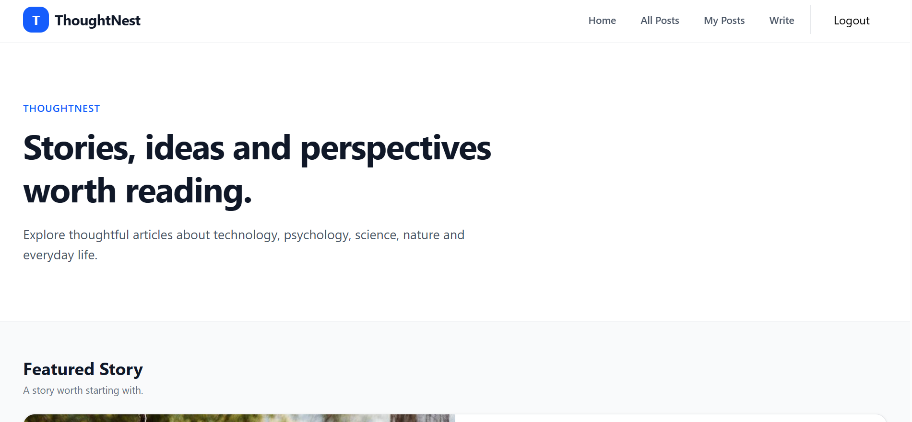
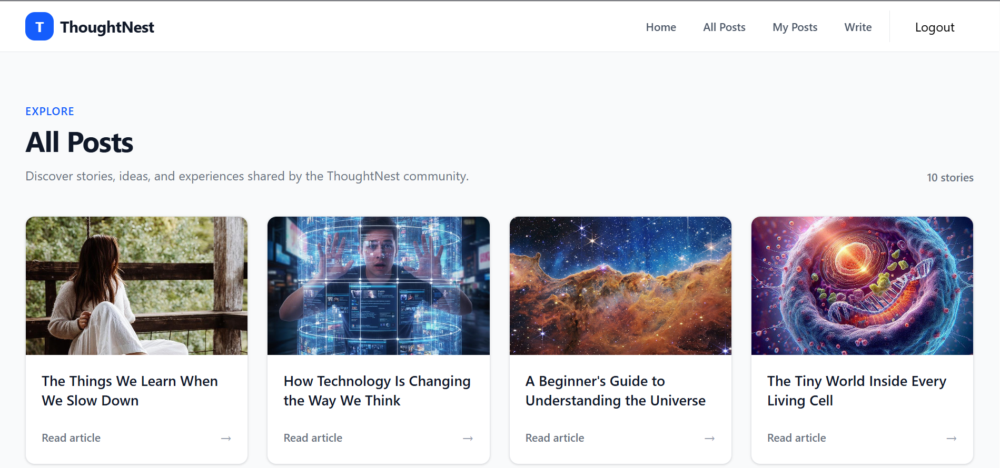
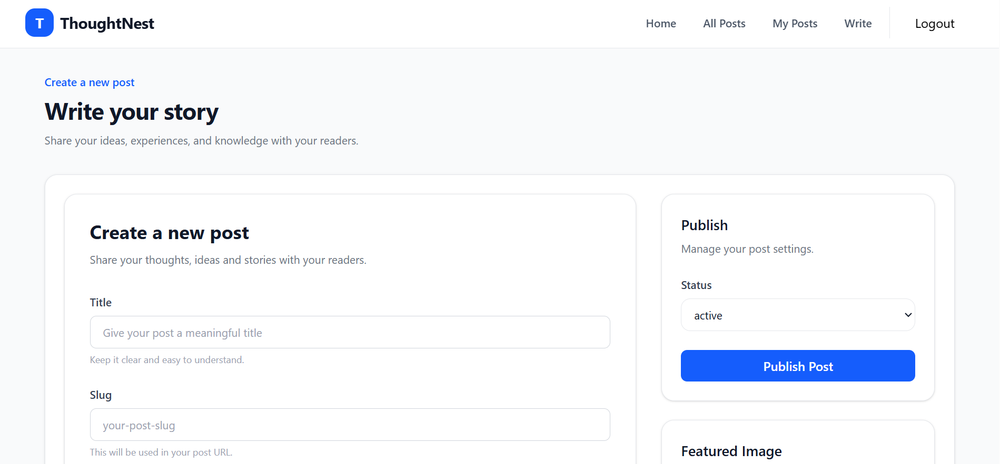

# ThoughtNest

ThoughtNest is a full-stack blogging platform I built with React and Appwrite.

The main goal of this project was to build something beyond a simple UI and understand how the different parts of a real web application work together — authentication, routing, state management, CRUD operations, file uploads, rich text editing, backend integration, and responsive design.

## Features

* User signup and login
* Authentication and protected routes
* Create blog posts
* Edit existing posts
* Delete posts
* Rich text editor for writing posts
* Image upload and preview
* View all posts
* View your own posts
* Individual post pages
* Responsive design for mobile, tablet, and desktop
* Loading and error states
* Scroll-position restoration when navigating back from a post
* Appwrite integration for authentication, database, and storage

## Tech Stack

### Frontend

* React
* React Router
* Redux Toolkit
* Tailwind CSS
* React Hook Form
* TinyMCE

### Backend

* Appwrite

  * Authentication
  * Database
  * Storage

### Tools

* Vite
* Git
* GitHub
* Vercel

## How ThoughtNest Works

The application is built around a React frontend connected to Appwrite as the backend.

A simplified flow looks like this:

```text
User
 ↓
React UI
 ↓
React Router / Redux
 ↓
Appwrite
 ├── Authentication
 ├── Database
 └── Storage
 ↓
Response
 ↓
React UI
```

For example, when a user creates a post, the form collects the title, content, slug, and featured image. The application then sends the required data to Appwrite, where the post and image are stored. The post can later be displayed, edited, or deleted through the application.

## Authentication

ThoughtNest uses Appwrite Authentication for user accounts.

The authentication flow includes:

```text
Signup
 ↓
Create user account
 ↓
Login
 ↓
Create authenticated session
 ↓
Access protected routes
 ↓
Get current user
 ↓
Logout
```

Protected pages such as creating, editing, and managing posts are only accessible to authenticated users.

## Project Structure

```text
src/
├── appwrite/
│   ├── auth.js
│   └── configuration.js
│
├── components/
│   ├── container/
│   ├── footer/
│   ├── header/
│   ├── post-form/
│   ├── AuthLayout.jsx
│   ├── Button.jsx
│   ├── Input.jsx
│   ├── Login.jsx
│   ├── Logo.jsx
│   ├── PostCard.jsx
│   ├── RTE.jsx
│   ├── Select.jsx
│   └── Signup.jsx
│
├── config/
│   └── config.js
│
├── pages/
│   ├── AddPost.jsx
│   ├── AllPost.jsx
│   ├── EditPost.jsx
│   ├── Home.jsx
│   ├── Login.jsx
│   ├── MyPosts.jsx
│   ├── Post.jsx
│   └── Signup.jsx
│
├── store/
│   ├── authSlice.js
│   └── store.js
│
├── App.jsx
├── index.css
└── main.jsx
```

## Getting Started

### 1. Clone the repository

```bash
git clone https://github.com/vijayrathod9021/ThoughtNest.git
```

### 2. Navigate to the project

```bash
cd ThoughtNest
```

### 3. Install dependencies

```bash
npm install
```

### 4. Configure environment variables

Create a `.env` file in the root directory and add the required Appwrite configuration.

You can use `.env.sample` as a reference.

```env
VITE_APPWRITE_URL=
VITE_APPWRITE_PROJECT_ID=
VITE_APPWRITE_DATABASE_ID=
VITE_APPWRITE_COLLECTION_ID=
```

Add your actual Appwrite values to `.env`.

> The `.env` file is ignored by Git and should not be committed to the repository.

### 5. Start the development server

```bash
npm run dev
```

The application will then be available on the local development URL provided by Vite.

## What I Learned

Building ThoughtNest helped me understand how the pieces of a larger React application fit together.

Some of the main things I worked with were:

* React component architecture
* React Router and protected routes
* Redux Toolkit for application state
* Authentication and user sessions
* Appwrite backend integration
* CRUD operations
* File uploads and storage
* Rich text editing
* Form handling
* Responsive UI with Tailwind CSS
* Loading and error handling
* Debugging real application issues
* Git and GitHub workflow
* Preparing a React application for deployment

One of the most useful parts of this project was debugging problems instead of only following a tutorial. It helped me understand the data flow between the UI, application state, and backend.

## Screenshots

### Home



### All Posts



### Write Post



## Live Demo

[View Live Demo](https://thoughtnest-app.vercel.app)

## Repository

[View Source Code on GitHub](https://github.com/vijayrathod9021/ThoughtNest)

## Author

**Vijay Rathod**

B.Sc. Computer Science student focused on building web applications and improving my skills in React, JavaScript, and full-stack development.

